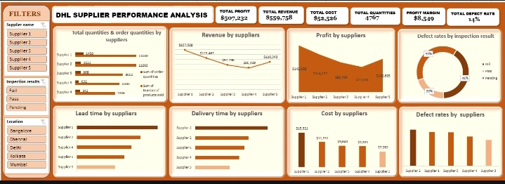
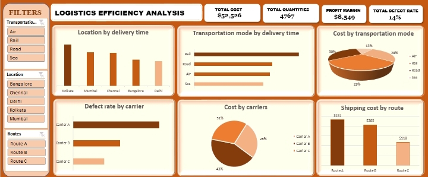

# SUPPLIER-PERFORMANCE-ANALYSIS-

An Excel-based interactive dashboard project that evaluates supplier efficiency, product quality, cost performance, and delivery timeliness to support strategic supply chain decisions for DHL.

## TABLE OF CONTENTS 
 [Description]() 
 
 [Overview]()

 [Problem Statement]() 
 
 [Objective]() 

 [Description]()

 [Key Areas Analyze]()
 
 [Tools]()
 
 [Dashboard]()
 
 [Insights]() 
 
 [Recommendation]()

 [Contant]()

 ## 📌 DESCRIPTION 
 
 This project delivers a comprehensive Supplier Performance Dashboard designed to help DHL analyze supplier effectiveness. Using metrics such as lead time, shipping time, defect rate, procurement cost, and inspection results, this tool identifies top-performing and underperforming suppliers.

## 📊 OVERVIEW 

DHL, a global logistics leader, depends on supplier reliability to ensure smooth deliveries and customer satisfaction. This Excel dashboard transforms raw supplier data into actionable visuals that improve procurement efficiency and optimize supply chain performance.

## ❓PROBLEM STATEMENT 

DHL faces the challenge of optimizing its supply chain operations to ensure seamless deliveries and maintain customer satisfaction. The efficiency of its network is closely tied to supplier performance.

To address this, DHL requires a robust Supplier Performance Analysis to:

1️⃣ Scrutinize metrics such as product quality, responsiveness, delivery performance, and cost.

2️⃣ Identify underperforming suppliers.

3️⃣ Improve on-time delivery and reduce inventory costs.

## 🎯OBJECTIVE 
1️⃣ Conduct a thorough supplier performance analysis

2️⃣ Evaluate and optimize supplier efficiency using data-driven insights.

3️⃣ Extract, analyze, and interpret supplier data to provide actionable procurement recommendations.

4️⃣ Identify and analyze KPIs such as delivery timeliness, product quality, cost, and inspection outcomes.

## 🧾 Data Description 

Below is a list of key variables included in the Supplier and Logistics dataset:

1️⃣ **SKU (Stock Keeping Unit)** : Unique identifier for each product within the inventory.

2️⃣ **Price** : The cost at which the product is sold.

3️⃣ **Number of Products Sold** : Total quantity of a product sold.

4️⃣ **Revenue Generated** : Total earnings generated from the sales of the product.

5️⃣ **Stock Levels** : Quantity of the product currently available in the inventory.

6️⃣ **Lead Times** : Time taken for the supplier to fulfill an order.

7️⃣ **Order Quantities** : Quantity of the product ordered from the supplier.

8️⃣ **Shipping Times** : Time taken for the product to be delivered to the customer.

9️⃣ **Shipping Carriers** : Companies responsible for transporting the products.

🔟 **Shipping Costs** : Costs associated with shipping the product to the customer.

1️⃣1️⃣ **Supplier Name** : Name of the supplier providing the product.

1️⃣2️⃣ **Location** : Location of the supplier's operations.

1️⃣3️⃣ **Manufacturing Lead Time** : Time required to manufacture the product.

1️⃣4️⃣ **Inspection Results** : Outcome of quality inspections conducted on the product.

1️⃣5️⃣ **Defect Rates** : Percentage of defective products identified during inspections.

1️⃣6️⃣ **Transportation Modes** : Modes of transportation used for product delivery.

1️⃣7️⃣ **Routes** : Specific routes taken for shipping a product.

1️⃣8️⃣ **Costs** : Various costs associated with manufacturing, shipping, and quality control.

## ✅ Key Areas Analyzed

This dashboard explores multiple supplier and logistics KPIs:

1️⃣ Total quantities and order quantities by suppliers 

2️⃣ Profit by suppliers  

3️⃣ Defect rate by suppliers  

4️⃣ Revenue by suppliers  

5️⃣ Lead time by suppliers  

6️⃣ Transportation modes by delivery time  

7️⃣ Defect rate by inspection result  

8️⃣ Delivery time by suppliers  

9️⃣ Location by delivery time  

🔟 Cost by transportation modes  

1️⃣1️⃣ Shipping cost by routes  

1️⃣2️⃣ Defect rates by carriers  

1️⃣3️⃣ Cost by carriers  

## ⚒️ TOOLS USED:

Microsoft Excel
  - Pivot Tables
  - Pivot Charts
  - Slicers & Interactivity

## 📊 DASHBOARD 

## 📊 Metrics Summary

Here are the key performance metrics from the supplier and logistics analysis:

✅**Total Revenue Generated:** $559,758  

✅**Total Profit:** $507,232  

✅**Profit Margin:** $8,549  

✅**Total Cost:** $52,526  

✅**Total Order Quantities:** 4,767  

✅**Percentage Defect Rate:** 14%

## 📊 INSIGHTS GAINED

✅ **Supplier 1 consistently outperforms** others in both quantities and order quantities supplied.

✅ **Supplier 2 has a significantly higher defect rate**, indicating possible quality or handling issues that may affect customer satisfaction.

✅ **Supplier 1 and Supplier 5** are the top revenue-generating suppliers.

✅ **Rail transportation** emerged as the fastest delivery mode, showcasing reliability and efficiency.

✅ **Road transport** accounts for the largest share of transportation budget, making it a major cost driver.

✅**Route A is the most expensive shipping route**, contributing disproportionately to shipping costs.

✅**Carrier B accounts for 42% of total shipping costs**, making it the highest logistics cost contributor.

✅**Carrier A has the highest defect rate**, suggesting frequent delays or damaged deliveries, which could negatively impact customer satisfaction and product quality.

## ✍️ Recommendations

1️⃣ Reevaluate **Supplier 2’s processes** to identify and address root causes of product defects.

2️⃣ Consider **increasing volume with Supplier 1 and Supplier 5** due to strong performance and high revenue generation.

3️⃣ Expand use of **rail transport** to benefit from its speed and reliability.

4️⃣ Optimize **road transport strategy** to reduce its high cost impact on the overall supply chain.

5️⃣ Reassess the use of **Route A**, exploring alternative routes to lower shipping expenses.

6️⃣ Investigate **Carrier A’s operational procedures** to reduce defect rates and improve delivery quality.
 
7️⃣ Conduct **quarterly reviews of top carriers and suppliers** using this dashboard for ongoing performance monitoring.

## Contact
Created by **Ajirola Amudat**  
For inquiries, connect on [LinkedIn](https://www.linkedin.com/in/ajirola-amudat-a-3083882b2?utm_source=share&utm_campaign=share_via&utm_content=profile&utm_medium=android_app)

